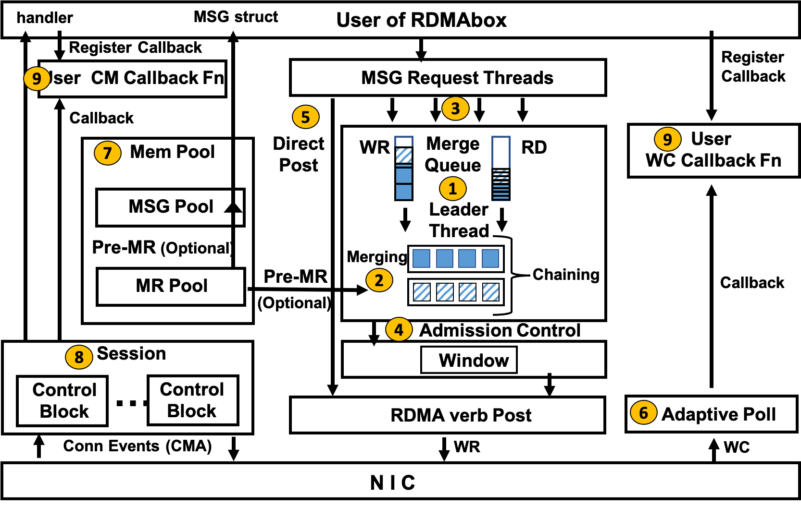

## Introduction


We present RDMAbox, a set of low level RDMA optimizations that provide better performance than previous approaches. The optimizations are packaged in easy-to-use kernel and user space libraries for applications and systems in data centers. We demonstrate the flexibility and effectiveness of RDMAbox by implementing a kernel remote paging system and a user space file system using RDMAbox. RDMAbox employs two optimization techniques. First, we suggest RDMA request merging and chaining to reduce the total number of I/O operations to the RDMA NIC. The I/O merge queue at the same time functions as a traffic regulator to enforce admission control and avoid overloading the NIC. Second, we propose Adaptive Polling to achieve higher efficiency of polling Work Completion than existing busy polling while maintaining the low CPU overhead of event trigger. Our implementation of a remote paging system with RDMAbox outperforms existing representative solutions with up to 4x throughput improvement and up to 83% decrease in average tail latency in bigdata workloads, and up to 83% reduction in completion time in machine learning workloads. Our implementation of a user space file system based on RDMAbox achieves up to 5.9x higher throughput over existing representative solutions.

This repository contains the source code of the following paper:
Juhyun Bae, Ling Liu, Yanzhao Wu, Gong Su, Arun Iyengar "RDMAbox : Optimizing RDMA for Memory Intensive Workloads" In IEEE CIC, 2021. [[PDF]](https://arxiv.org/abs/2104.12197)

This repository is for Mellanox ConnectX-3 driver with kernel 3.13 for fair comparison with previous approach in evaluation.

RDMAbox for Inbox Kernel 4.x version is coming soon.

## Installation and Dependencies for Experiments in Paper (Kernel space Remote Paging System example)

1. Install MLNX_OFED driver
```bash
wget http://www.mellanox.com/downloads/ofed/MLNX_OFED-3.1-1.0.3/MLNX_OFED_LINUX-3.1-1.0.3-ubuntu14.04-x86_64.tgz .
tar -xvf MLNX_OFED_LINUX-3.1-1.0.3-ubuntu14.04-x86_64.tgz
cd ~/MLNX_OFED_LINUX-3.1-1.0.3-ubuntu14.04-x86_64
sudo ./mlnxofedinstall --add-kernel-support --without-fw-update --force
```

2. Install

(for both client and server node)
```bash
cd ~/RDMAbox/kernel/setup
./compile.sh
```

3. Run remote paging example

Assume that IP address is 100.10.10.0(client)/100.10.10.1(peer1)/100.10.10.2(peer2)/100.10.10.3(peer3) and disk partion is /dev/sda3

(Modify portal list for Daemon nodes: repeat below for node 2 and 3 with their own address information)

vi ~/RDMAbox/kernel/setup/daemon_portal.list
```bash
3 -> number of daemon nodes
100.10.10.1:9999 -> IPaddr and Port
100.10.10.2:9999
100.10.10.3:9999
```

(Run Daemon nodes at each node with their own address)

```bash
cd ~/RDMAbox/kernel/setup/
~/ib_setup.sh 100.10.10.1

cd ~/RDMAbox/kernel/daemon
./daemon -a 100.10.10.1 -p 9999 -i "/users/username/rdmabox/setup/portal.list"
```

(Modify portal list for client node)

vi ~/RDMAbox/kernel/setup/bd_portal.list
```bash
100.10.10.0 -> my(i.e. client) address
3 -> number of daemon nodes
100.10.10.1:9999 -> IPaddr and Port
100.10.10.2:9999
100.10.10.3:9999
```

(Run Client node)
```bash
cd ~/RDMAbox/kernel/setup/
~/ib_setup.sh 100.10.10.0
sudo swapoff /dev/sda3
sudo ~/bd_setup.sh 0
```

(Check)

sudo swapon -s (on client node)

## Setting parameters

RDMAbox/kernel/bd/rdmabox.h

- SERVER_SELECT_NUM [number]

  This number should be equal to or less than the number of peer nodes.(e.g. if 3 peers, this should be <=3)

- NUM_REPLICA [number]

  Number of replicated copies on peer nodes.
```bash
#define SERVER_SELECT_NUM 2
#define NUM_REPLICA 1
```

RDMAbox/kernel/bd/rpg_drv.h

- SWAPSPACE_SIZE_G [number]

  Set total size of swapspace for remote paging system

- BACKUP_DISK [string]

  Set disk partition path is diskbackup is used. (By default, remote paging system does not use diskbackup. Use replication)

```bash
#define SWAPSPACE_SIZE_G        40
#define BACKUP_DISK     "/dev/sda4"
```

## Supported Platforms for paging system example

Tested environment:

OS : Ubuntu 14.04(kernel 3.13.0)

RDMA NIC driver: MLNX_OFED 3.1 and Inbox driver

Hardware : Infiniband, Mellanox ConnectX-3/4, disk partition(Only if diskbackup option is enabled.)


## Installation and Dependencies for Experiments in Paper (Userspace Network File System example)

We use "inbox RDMA driver" for userspace RDMA.

1. Fuse driver install

Use install scripts under RDMAbox/userspace/libfuse
```bash
For fuse permission, 
sudo vi /etc/fuse.conf
add below in the fuse.conf
user_allow_other
```

2. RDMA inbox driver setting
```bash
sudo vi /etc/security/limits.conf 
add below in limits.conf for both client and server(daemon) side
Note that empty space must be a tab(not space)
*	hard	memlock		unlimited
*	soft	memlock		unlimited
```

Reboot the system. In next booting, check with ulimit -a
```bash
max locked memory       (kbytes, -l) unlimited
max memory size         (kbytes, -m) unlimited
```

3. Run user space network file system example

#build rdmabox userspace modules
```bash
RDMAbox/userspace/setup/compile.sh
```

#edit daemonportal
```bash
vi RDMAbox/userspace/rdmabox/daemon/daemonportal
Add daemon address. First line is the number of total daemon servers.
1
100.100.100.91:9999
```

#run daemon
```bash
RDMAbox/userspace/rdmabox/daemon/daemon -a 100.100.100.92 -p 9999 -i "rdmabox/userspace/rdmabox/daemon/daemonportal"
```

#run rdmabox client
```bash
RDMAbox/userspace/ramdisk/ramdisk/run.sh 100.100.100.91
```

## RDMAbox API part
Coming soon...


## Status
The code is provided as is, without warranty or support. If you use our code, please cite:
```
@inproceedings{bae2021rdmabox,
  title={RDMAbox : Optimizing RDMA for Memory Intensive Workloads},
  author={Bae, Juhyun and Liu, Ling and Wu, Yanzhao and Su, Gong and Iyengar, Arun},
  booktitle={IEEE International Conference on Collaboration and Internet Computing},
  year={2021},
  organization={IEEE}
}
```
